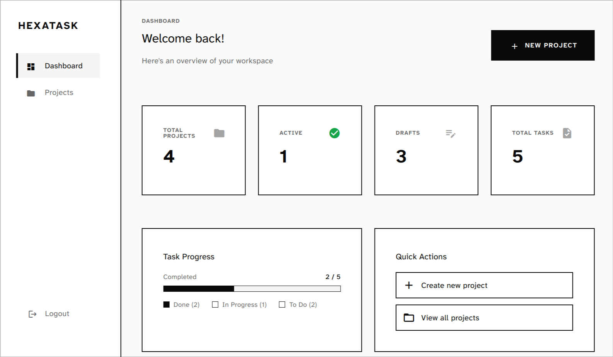
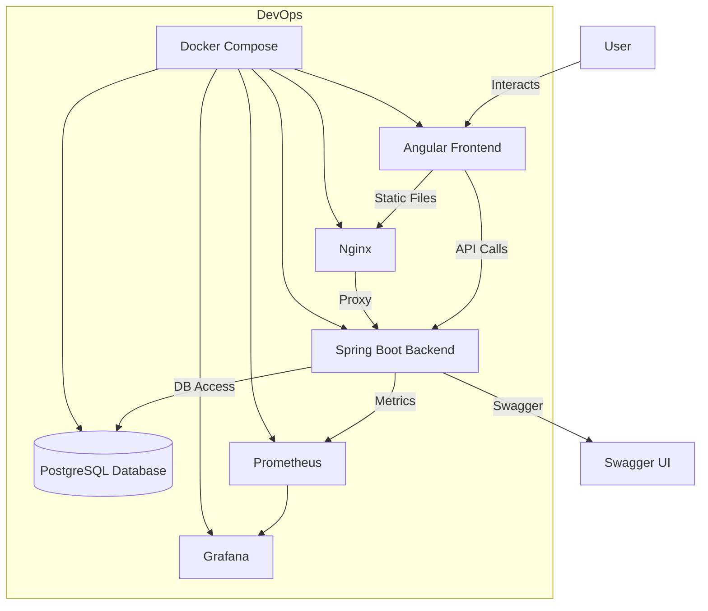

<center>
<h1>HexaTask</h1>
<h3>Domain-Driven Project & Task Management System</h3>
</center>

<center>

<!-- Badges -->
<a href="https://www.java.com/"></a>
<a href="https://spring.io/projects/spring-boot"></a>
<a href="https://angular.io/"></a>
<a href="https://www.postgresql.org/"></a>
<a href="https://github.com/TonyS-dev/hexatask/actions"></a>
<a href="https://opensource.org/licenses/MIT"></a>

</center>

---

## Live Demo 

Live URL here:

```
https://hexatask.tonys-dev.com/
```

---



---

## Overview

HexaTask is a full-stack project and task management system built with Domain-Driven Design and Hexagonal Architecture. It features robust authentication, ownership-based authorization, audit logging, and comprehensive observability. Designed for clean code, scalability, and developer experience, HexaTask enables seamless management of projects and tasks with modern UI and API.

### Architecture Flow



---

## Tech Stack

**Frontend**
- Angular 17 (Signals API, Material UI)
- TypeScript 5.4
- RxJS 7.8
- Tailwind CSS 3.4
- Nginx (for static serving & API proxy)

**Backend**
- Java 17
- Spring Boot 3.4.1
- Spring Security (JWT dual token)
- Hibernate Envers (audit logging)
- Spring Data JPA
- Flyway (DB migrations)
- Micrometer (metrics)

**Database & Infrastructure**
- PostgreSQL 15
- Docker & Docker Compose
- Prometheus (metrics)
- Grafana (visualization)

**Testing & Quality**
- JUnit 5, Mockito (backend)
- Jasmine, Karma (frontend)
- Swagger/OpenAPI (API docs)

**DevOps & Deployment**
- Gradle (backend build)
- Node.js & npm (frontend build)
- Docker Compose (multi-service orchestration)

---

## Project Structure

```
hexatask/
├── backend/
│   ├── src/
│   │   ├── main/
│   │   │   ├── java/com/hexatask/hexatask/   # domain, application, infrastructure
│   │   │   └── resources/                   # application.yml, db/migration
│   ├── src/test/                            # unit & integration tests
│   ├── Dockerfile
│   └── build.gradle
├── frontend/
│   ├── src/
│   │   ├── app/                             # core, features, shared
│   │   └── main.ts
│   ├── package.json
│   ├── angular.json
│   └── Dockerfile
├── scripts/
│   ├── setup.sh
│   ├── run.sh
│   └── dev/
│       ├── start.sh
│       ├── stop.sh
│       └── logs.sh
├── docker-compose.yml
├── .env (example created by scripts/setup.sh)
└── README.md
```

---

## Getting Started

### Prerequisites

- Java 17+
- Node.js >= 16
- npm (or yarn)
- Docker & Docker Compose
- PostgreSQL 15 (if running backend outside Docker)

### Installation

1. **Clone the repository**
   ```bash
   git clone https://github.com/TonyS-dev/hexatask.git
   cd hexatask
   ```

2. **Setup environment**
   ```bash
   chmod +x scripts/setup.sh scripts/run.sh
   ./scripts/setup.sh
   # Edit .env with your values
   nano .env
   ```

3. **Run the application**
   ```bash
   ./scripts/run.sh
   ```

   - Or use Docker Compose directly:
     ```bash
     docker compose up --build
     ```

### Environment Variables

Create a `.env` file in the root directory with:

```
DB_NAME=hexatask
DB_USER=youruser
DB_PASSWORD=yourpassword
DB_PORT=5432
JWT_SECRET=your_jwt_secret
JWT_EXPIRATION=900
VITE_API_BASE_URL=http://localhost:8080/api
```

---

## Features

- Domain-Driven Design (Hexagonal Architecture)
- JWT Dual Token Authentication (Access + Refresh)
- Ownership-based Authorization
- Soft Delete with Audit Trail
- Comprehensive Unit Tests
- Swagger/OpenAPI Documentation
- Docker & Docker Compose Support
- Paginated project listing with filtering
- Real-time metrics (Prometheus/Grafana)
- Responsive Angular UI

---

## Usage

- **Login/Register:** Access the frontend at [http://localhost:4200](http://localhost:4200)
- **Manage Projects/Tasks:** Create, update, delete, and filter projects/tasks
- **API:** Use Swagger UI at [http://localhost:8080/swagger-ui.html](http://localhost:8080/swagger-ui.html) for API exploration

**Example: Running locally**

```bash
cd backend
./gradlew bootRun
# In another terminal
cd frontend
npm install
npm start
```

---

## API Documentation

- **Swagger UI:** [http://localhost:8080/swagger-ui.html](http://localhost:8080/swagger-ui.html)
- **OpenAPI JSON:** `/v3/api-docs`
- See backend `HELP.md` for Spring Boot API guides

---

## Testing

**Backend:**
```bash
cd backend
./gradlew test
```

**Frontend:**
```bash
cd frontend
npm test
```

---

## Deployment

- **Production build (frontend):**
  ```bash
  cd frontend
  npm run build
  ```
- **Build backend JAR:**
  ```bash
  cd backend
  ./gradlew build
  ```
- **Deploy with Docker Compose:**
  ```bash
  docker compose up --build
  ```

---

## Contributing

1. Fork the repository
2. Create a feature branch
3. Submit a pull request with clear description

---

## License

MIT License (see LICENSE file or [opensource.org/licenses/MIT](https://opensource.org/licenses/MIT))

---

## Author / Contact

**Antonio Santiago (TonyS-dev)**  
- [GitHub](https://github.com/TonyS-dev)  
- Email: santiagor.acarlos@gmail.com

---

Let me know if you want to add screenshots, more API details, or further customization.

## ✅ Prerequisites

- Java 17+ (Gradle wrapper will download matching distribution)
- Node.js >= 16 (for Angular frontend)
- npm (or yarn) for package management
- Docker & Docker Compose (for containerized setup)
- PostgreSQL 15 (if running backend without Docker)

## 🚀 Quick Start (Recommended)

### Linux/macOS

```bash
chmod +x scripts/setup.sh scripts/run.sh
./scripts/setup.sh  # First time only - sets up Docker and environment
./scripts/run.sh    # Starts all services
```

### Windows (PowerShell)

```powershell
Set-ExecutionPolicy RemoteSigned -Scope CurrentUser  # First time only
.\scripts\setup.ps1  # Sets up Docker and environment
.\scripts\run.ps1    # Starts all services
```

**Services will start at:**
- Frontend: http://localhost:4200
- Backend API: http://localhost:8080
- Swagger UI: http://localhost:8080/swagger-ui.html
- Prometheus: http://localhost:9090
- Grafana: http://localhost:3000

See [scripts/README.md](scripts/README.md) for detailed documentation.

## ⚙️ Manual Installation & Run

### A) Full-stack (recommended, Docker)

```bash
docker compose up --build
```

**Access the application:**
- Frontend: http://localhost:4200
- Backend API: http://localhost:8080
- Swagger UI: http://localhost:8080/swagger-ui.html
- Prometheus: http://localhost:9090
- Grafana: http://localhost:3000

### B) Run frontend + backend locally (no Docker)

**Start backend:**

```bash
cd backend
./gradlew bootRun
```

**Start frontend** (in another terminal):

```bash
cd frontend
npm install
npm start
```

Frontend will be available at http://localhost:4200

### Test Credentials

```
User 1 (Owner of sample projects):
- Email: juan@mail.com
- Password: password123

User 2 (Different user):
- Email: anto@mail.com
- Password: password123
```

## 📦 Scripts & Useful Commands

**Backend** (inside `backend/`):

```bash
./gradlew bootRun              # Run the Spring Boot app
./gradlew build                # Build jar
./gradlew test                 # Run unit tests
./gradlew clean build -x test  # Build without tests
```

**Frontend** (inside `frontend/`):

```bash
npm install                    # Install dependencies
npm start                      # Start Angular dev server
npm run build                  # Build production bundle
npm run lint                   # Run ESLint
```

**Docker Compose** (repo root):

```bash
docker compose up --build      # Start all services
docker compose down            # Stop all services
docker compose logs -f         # View logs
```

## 🔑 Authentication & Authorization

### Dual Token Strategy

The backend exposes `/api/auth/login` and `/api/auth/register` endpoints with a secure dual-token approach:

- **Access Token** (JWT, 15 minutes) — Used for API requests
- **Refresh Token** (JWT, 30 minutes) — Persisted in DB, enables token rotation
- On token refresh, old tokens are immediately deleted for enhanced security
- Frontend stores both tokens in `localStorage` and sends access token in `Authorization: Bearer` header

### Ownership-based Authorization

Every write operation validates that the authenticated user owns the resource:

```java
// Example: Only project owner can activate
if (!project.getOwnerId().equals(currentUserId)) {
    throw new UnauthorizedException("403 Forbidden");
}
```

Applied to all critical operations:
- ✅ GetProject — owner verification
- ✅ ActivateProject — owner verification + business rules
- ✅ CreateTask — project owner verification
- ✅ UpdateTaskStatus — project owner verification
- ✅ ListProjects — filtered by owner (no data exposure)

## 📚 API Documentation (Swagger/OpenAPI)

Comprehensive API documentation using Swagger/OpenAPI 3.0.

**Access Swagger UI:**

🔗 http://localhost:8080/swagger-ui.html

**API Groups:**
- **Authentication API** (`/api/auth`)
  - User registration
  - User login (returns dual tokens)
  - Token refresh
  
- **Projects API** (`/api/projects`)
  - List user's projects (paginated & filtered)
  - Create new project
  - Get project details
  - Activate project
  
- **Tasks API** (`/api/projects/{projectId}/tasks`)
  - Create task
  - Complete task
  - List tasks

**Authentication in Swagger UI:**
1. Login via `/api/auth/login`
2. Copy the JWT token from the response
3. Click "Authorize" button at the top
4. Enter: `Bearer {your-token}`
5. Click "Authorize" and close

**Alternative API Docs:**
- OpenAPI JSON: http://localhost:8080/v3/api-docs
- OpenAPI YAML: http://localhost:8080/v3/api-docs.yaml

## 🔍 Monitoring & Observability

**Actuator Endpoints:**

```bash
curl http://localhost:8080/actuator/health
curl http://localhost:8080/actuator/metrics
curl http://localhost:8080/actuator/prometheus
```

**Prometheus & Grafana:**
- Prometheus UI: http://localhost:9090
- Grafana: http://localhost:3000

**Metrics available:**
- HTTP server metrics: `http.server.requests`
- JVM metrics: `jvm.memory.*`, `jvm.gc.*`, `process.cpu.*`
- Data source metrics (HikariCP): `hikaricp.*`
- Cache metrics: `cache.*`

In production, lock down actuator endpoints with proper authentication and only expose minimum required endpoints.

## 🏗️ Architecture

### Hexagonal Design (Clean Architecture)

Strict separation of concerns across 4 layers:

```
domain/              → Pure business logic (no Spring, no JPA)
  ├─ model/          → Entities (User, Project, Task)
  ├─ ports/          → Interfaces (UseCases IN, Dependencies OUT)
  └─ events/         → Domain events (ProjectActivated, TaskCompleted)

application/         → Business logic orchestration
  ├─ usecase/        → Implementation of ports
  └─ dto/            → Data Transfer Objects

infrastructure/      → Framework & external integration
  ├─ web/            → Controllers, REST endpoints
  ├─ adapters/       → Repository implementations, Security, Audit
  ├─ entities/       → JPA entities (separate from domain)
  ├─ mappers/        → Domain ↔ Entity conversions
  └─ config/         → Spring configuration

presentation/        → Frontend (Angular)
```

### Key Design Patterns

- **Ports & Adapters**: Domain is independent of frameworks
- **Dependency Injection**: All dependencies injected via constructors
- **Strategy Pattern**: Configurable notification system
- **Mapper Pattern**: Strict separation between Domain and JPA entities
- **Soft Delete**: Logical deletion with `deleted` flag
- **Event Publishing**: Domain events for decoupled cross-cutting concerns

### Security Headers

- JWT validated on every request via `JwtAuthenticationFilter`
- Credentials stored securely with BCrypt password encoder
- Refresh tokens persisted in DB for revocation capability

## 🗄️ Database

### Migrations

Flyway manages all schema changes automatically:
- `V1__create_tables.sql` — Initial schema (User, Project, Task)
- `V2__create_audit_tables.sql` — Audit logging tables
- `V3__add_task_status.sql` — Add task status column
- `V5__insert_test_data.sql` — Test credentials and sample data

**Features:**
- Soft delete pattern (records marked as deleted, never removed)
- Optimistic locking via `version` field
- Foreign keys with CASCADE DELETE (logical)
- Indexes on frequently queried columns (owner_id, created_at)

### Seed Data

Test credentials and sample projects are inserted via Flyway migrations. Data is idempotent via `ON CONFLICT` clauses.

## 🧪 Testing

**Unit Tests (JUnit 5 + Mockito):**

```bash
cd backend
./gradlew test
```

**Test Coverage (5 critical tests):**
- ✅ `ActivateProject_WithTasks_ShouldSucceed` — Happy path
- ✅ `ActivateProject_WithoutTasks_ShouldFail` — Business rule validation
- ✅ `ActivateProject_ByNonOwner_ShouldFail` — Ownership validation
- ✅ `CompleteTask_AlreadyCompleted_ShouldFail` — State validation
- ✅ `CompleteTask_TaskNotFound_ShouldFail` — Resource not found

All mocks injected, no Spring context loaded (true unit tests).

## 🛠️ Technical Decisions

### 1. Ownership Validation (Security)

**Why:** Users should only access their own resources.

**How:** `CurrentUserPort` extracts authenticated user ID from JWT, then each use case validates:

```java
UUID currentUserId = currentUserPort.getCurrentUserId();
if (!resource.getOwnerId().equals(currentUserId)) {
    throw new UnauthorizedException("403 Forbidden");
}
```

**Result:** 403 Forbidden if user tries to access/modify another user's resource.

### 2. Dual Token Strategy (Security)

**Why:** Access tokens are short-lived to minimize risk if stolen, refresh tokens enable persistent sessions.

**How:** 
- Access Token: 15 minutes (in-memory JWT)
- Refresh Token: 30 minutes (persisted in DB)
- On refresh: old token deleted, new pair generated (rotation)

**Result:** Better security than single long-lived token, better UX than forcing re-login every 15 min.

### 3. Hexagonal Architecture (Maintainability)

**Why:** Clean separation enables easy testing and refactoring.

**How:** 
- Domain layer has NO Spring dependencies
- Application layer contains use cases
- Infrastructure adapts to frameworks (Spring, JPA, REST)
- Tests mock all output ports

**Result:** Business logic isolated from framework changes, highly testable.

### 4. Soft Delete Pattern (Data Integrity)

**Why:** Audit trail and compliance require keeping deleted data.

**How:** Entities have `deleted: boolean` flag, queries filter `WHERE deleted = false` automatically.

**Result:** No permanent data loss, full audit history maintained.

### 5. Mapper Pattern (Clean Architecture)

**Why:** Keep domain entities independent of JPA annotations.

**How:** 
- Domain entities (User, Project, Task) are POJOs
- JPA entities (UserEntity, ProjectEntity, TaskEntity) have `@Entity` annotations
- Mappers convert between layers

**Result:** Domain code has zero framework knowledge, easy to port to different ORM.

### 6. Event Publishing (Decoupling)

**Why:** Audit and notifications shouldn't be tightly coupled to business logic.

**How:** 
- Use cases publish domain events (ProjectActivatedEvent, TaskCompletedEvent)
- Infrastructure listeners subscribe to events
- Listeners are implementations of output ports

**Result:** Use cases focused on business logic, cross-cutting concerns handled by adapters.

## 📂 Project Structure

```
hexatask/
├── backend/
│   ├── src/main/java/com/hexatask/hexatask/
│   │   ├── domain/              # Pure business logic (no Spring)
│   │   │   ├── model/           # Domain entities
│   │   │   ├── ports/           # Interfaces (in/out)
│   │   │   └── events/          # Domain events
│   │   ├── application/         # Use cases & orchestration
│   │   ├── infrastructure/      # Adapters & frameworks
│   │   │   ├── web/             # Controllers
│   │   │   ├── adapters/        # Repository, Security, Audit
│   │   │   ├── entities/        # JPA entities
│   │   │   ├── mappers/         # Domain ↔ Entity mapping
│   │   │   └── config/          # Spring config
│   │   └── HexataskApplication.java
│   ├── src/test/java/           # Unit tests (JUnit 5 + Mockito)
│   ├── src/main/resources/
│   │   ├── application.yml      # Configuration
│   │   └── db/migration/        # Flyway migrations
│   ├── Dockerfile
│   ├── build.gradle
│   └── gradlew
├── frontend/
│   ├── src/
│   │   ├── app/
│   │   │   ├── core/            # Services, guards, interceptors
│   │   │   ├── features/        # Feature modules (auth, projects, tasks)
│   │   │   └── shared/          # Shared components
│   │   └── main.ts
│   ├── Dockerfile
│   ├── angular.json
│   ├── package.json
│   └── tsconfig.json
├── docker-compose.yml
├── scripts/                     # Dev helper scripts
└── README.md                    # <- You are here
```

## 🧩 Frontend Notes

- Axios is configured centrally with an interceptor to add `Authorization: Bearer <token>` to outgoing requests
- Server-state is handled via RxJS observables and Angular's reactive patterns
- Core services manage API calls, authentication, and route guards
- Feature modules encapsulate domain-specific logic (auth, projects, tasks)
- Angular Material provides UI components with TailwindCSS customization

## ✅ Troubleshooting

**Frontend not loading?**
```bash
rm -rf node_modules dist .angular/cache
npm install
npm start
```

**Backend compilation error?**
```bash
./gradlew clean build -x test
```

**Database migration failed?**
```bash
# Ensure PostgreSQL is running
docker ps
# Check logs for migration errors
docker compose logs postgres
```

**Swagger UI not loading?**
- Backend must be running on port 8080
- Try: http://localhost:8080/swagger-ui.html
- Check backend logs: `docker compose logs backend`

## 📦 Deployment

- Frontend production build: `cd frontend && npm run build`
- Backend containerized via `backend/Dockerfile`
- Both deployable with Docker / Kubernetes
- Use provided `docker-compose.yml` for orchestration

## 🤝 Contributing

Contributions are welcome. Suggested workflow:
1. Fork the repo
2. Create a feature branch
3. Add tests where appropriate
4. Open a PR describing the change

Please follow existing code style and run linting before opening pull requests.

## 📝 License

This project is licensed under the MIT License. See the LICENSE file for details.

## 👤 Author / Contact

- **Name:** Antonio Santiago (TonyS-dev)
- **GitHub:** https://github.com/TonyS-dev
- **Email:** santiagor.acarlos@gmail.com
